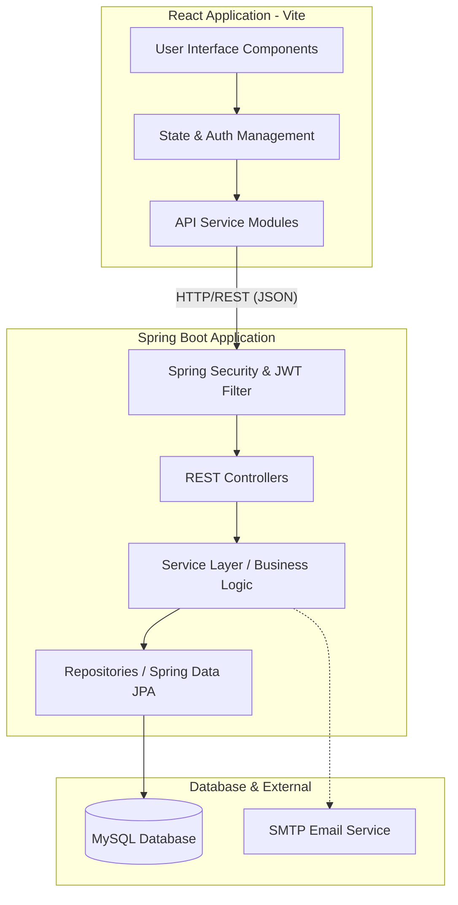

# Enterprise Procurement System

## Project Introduction

The Enterprise Procurement System is a centralized, role-based web application designed to streamline the request-to-delivery lifecycle of organizational purchases. 

It solves the inefficiencies, lack of transparency, and manual bottlenecks associated with traditional procurement methods (e.g., disjointed email chains, lost requests, and untracked budgets). The system brings Employees, Administrators, and Suppliers onto a single, unified platform where every purchase request is digitally tracked, approved, and fulfilled.

## Vision / Objective

The primary goal of this project is to automate the procurement workflow to save time, enforce budget compliance, and provide real-time visibility into order fulfillment. The system is intended to eliminate manual paperwork and centralize communication between internal teams and external suppliers, ensuring a transparent and auditable purchasing process.

## Key Features

- **Role-Based Access Control (RBAC):** Distinct portals and capabilities for Employees, Admins, and Suppliers.
- **Automated Workflow:** End-to-end tracking from request submission to final delivery.
- **Budget Tracking & Analytics:** Interactive dashboards providing real-time spending insights.
- **Supplier Integration:** Suppliers can directly update delivery statuses.
- **Notifications:** In-app alerts to keep users informed about order updates.

## How the System Works

The application operates on a strict Role-Based Access model:

1. **Request Phase**: An **Employee** browses available products and submits a purchase request (issue), providing necessary justifications and quantity details.
2. **Approval Phase**: An **Admin** reviews the request via their dashboard. They assess the justification and budget, and then approve or reject the request.
3. **Order & Payment Phase**: Upon approval, the Admin initiates payment for the request. The system then automatically generates a Purchase Order (PO) and routes it to the designated Supplier.
4. **Fulfillment Phase**: The **Supplier** logs in to view incoming orders. They prepare the items, update logistics statuses (e.g., "In Transit"), and eventually mark the order as "Delivered".
5. **Feedback Phase**: The **Employee** confirms receipt and provides a rating/feedback on the delivery experience, completing the lifecycle.

## System Architecture

The project follows a modern decoupled Client-Server architecture. The React-based frontend communicates with the Spring Boot backend via RESTful APIs, utilizing JWT for stateless authentication.

## System Flow Diagram



## Internal / Business Rules

- Only **Admins** can approve requests and process payments.
- **Suppliers** can only view and update the status of Purchase Orders specifically assigned to them.
- Employees can only see their own requests and leave feedback once an item is marked "Delivered".
- Passwords are encrypted before storage and authentication tokens (JWT) must be passed with all protected requests.

## API Overview

The frontend communicates with the backend via stateless, JSON-based REST APIs. Authentication is secured via Bearer tokens (JWT) passed in the `Authorization` header.

Major API groups include:
- **`/api/auth/*`**: Handles user authentication, registration (employees, admins, suppliers), and JWT generation/validation.
- **`/api/users/*`, `/api/admin/*`, `/api/supplier/*`**: Aggregates metrics and analytics data for role-specific dashboards.
- **`/api/issues/*`**: Manages the core purchase requests (creating, fetching by role, updating approval statuses).
- **`/api/products/*` & `/api/categories/*`**: Manages the catalog of items available for procurement.
- **`/api/departments/*`**: Handles organizational structure and department admin assignments.
- **`/api/admin/purchase-orders/*`**: Handles PO generation and payment processing.
- **`/api/supplier/orders/*`**: Allows suppliers to view their specific orders and update fulfillment statuses.
- **`/api/notifications/*`**: Manages in-app user notifications.

## Technology Stack

### Frontend
- **React (v19)**: Core UI library.
- **Vite**: Frontend tooling for fast development builds.
- **Tailwind CSS (v4)**: Utility-first CSS framework.
- **React Router DOM**: Client-side routing.
- **Recharts**: For rendering interactive charts.
- **Lucide React**: Iconography.

### Backend
- **Java 21**: Core programming language.
- **Spring Boot (v3.x)**: Application framework for REST APIs.
- **Spring Security & JWT**: Authentication and Access Control.
- **Spring Data JPA / Hibernate**: ORM for database interactions.
- **Maven**: Build tool.

### Database
- **MySQL**: Relational database for production data.

## Project Structure

```text
procurement-system/
├── .env .example           # Environment variables template
├── pom.xml                 # Maven backend dependencies
├── src/                    # Backend Source Code (Java)
│   └── main/
│       ├── java/com/infosys/procurement_system/
│       │   ├── config/     # App & Security configurations
│       │   ├── controller/ # REST API Endpoints
│       │   ├── dto/        # Data Transfer Objects
│       │   ├── entity/     # JPA Database Models
│       │   ├── repository/ # Database Access Layer
│       │   ├── security/   # JWT filters and auth logic
│       │   └── service/    # Core Business Logic
│       └── resources/
│           └── application.yaml # Backend application properties
└── frontend/               # Frontend Source Code (React)
    ├── package.json        # NPM dependencies
    ├── vite.config.js      # Vite configuration
    └── src/
        ├── assets/         # Static assets (images, fonts)
        ├── components/     # Reusable UI components
        ├── context/        # React context (e.g., AuthProvider)
        ├── pages/          # Full page views by role (Admin, Employee, Supplier)
        ├── services/       # API abstraction (api.js, authService.js, etc.)
        ├── App.jsx         # Main application routing
        └── index.css       # Global styles (Tailwind imports)
```

## Local Setup

### Prerequisites
- **Java Development Kit (JDK) 21**
- **Node.js** (v18 or higher) & **npm**
- **MySQL Server** (Running locally or via Docker)

### Step 1: Database Setup
1. Start your MySQL instance.
2. Create an empty database named `Procurement_db`.
   ```sql
   CREATE DATABASE Procurement_db;
   ```

### Step 2: Backend Setup
1. Navigate to the root directory of the project.
2. Ensure you have configured your environment variables (see below).
3. Run the backend using the Maven wrapper:
   ```bash
   # Windows
   mvnw.cmd spring-boot:run

   # Mac/Linux
   ./mvnw spring-boot:run
   ```
4. The backend will start on `http://localhost:8080`.

### Step 3: Frontend Setup
1. Navigate to the `frontend` directory:
   ```bash
   cd frontend
   ```
2. Install Node dependencies:
   ```bash
   npm install
   ```
3. Start the Vite development server:
   ```bash
   npm run dev
   ```
4. The application will be accessible at `http://localhost:5173`.

## Environment Variables

The backend relies on several environment variables configured in `src/main/resources/application.yaml`. You should provide these variables via your local environment or a `.env` file at the root of the project. 

> **Important**: Never commit actual passwords, API keys, or JWT secrets to version control. The `.env` file is excluded via `.gitignore`.

**Required Backend Variables:**
- `USER_NAME_DB`: MySQL Database username (Default: `root`)
- `PASSWORD_DB`: MySQL Database password
- `JWT_SECRET`: A secure Base64 encoded secret string for signing JWTs.
- `JWT_EXPIRATION`: Token expiration time in milliseconds (Default: `86400000` / 24 hours).
- `SPRING_MAIL_USERNAME`: SMTP email address for sending notifications.
- `SPRING_MAIL_PASSWORD`: SMTP app password.
- `APP_ADMIN_EMAIL`: The email address for the initial bootstrapped admin.
- `APP_ADMIN_PASSWORD`: The password for the initial bootstrapped admin.

## Initial Admin Setup

During application startup, the system creates an initial ADMIN account if no ADMIN user exists. The admin credentials must be provided through environment variables. 

To configure this locally, set the following environment variables (e.g. in your `.env` file):
```env
APP_ADMIN_EMAIL=admin@example.com
APP_ADMIN_PASSWORD=<your-secure-password>
```
If these variables are missing, the application will fail to start and throw an error to prevent silent creation of unsecure accounts. The developer must configure their own values locally.

## Usage

Once the application is running:
1. **Initial Registration**: Navigate to the registration page. Register an initial User account. 
2. **Employees**: Log in, browse the product catalog, and click "Raise Request" to initiate a purchase.
3. **Admins**: Log in (using the initial setup credentials), navigate to the Dashboard to see pending requests, click to approve, and proceed to the Payment section to generate POs.
4. **Suppliers**: Register/Login as a supplier, view assigned Purchase Orders, and update the status from "Pending" to "Delivered".